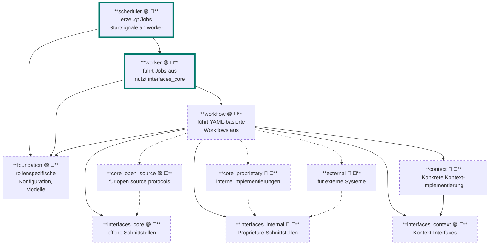

# SYSTEMARCHITEKTUR.md

## 🧭 Zweck der Architektur

Dieses System ist darauf ausgelegt, dokumentenbasierte Prozesse (z. B. OCR, Klassifikation, Datenextraktion) in einer modularen, workflowgesteuerten Umgebung auszuführen.  
Die Architektur erlaubt sowohl proprietäre als auch Open-Source-Workflows und ist auf maximale Erweiterbarkeit, Testbarkeit und Rollentrennung ausgelegt.

---

## 🧱 Komponentenübersicht

---

### Legende

- 🔷 = Laufender Service  
- ◻️ = Bibliothek / passive Komponente  
- 🟢 = Open Source  
- 🔴 = Proprietär  
- ➝ = Compile-Zeit-Referenz (Import)  
- ╌➝ = Laufzeit-Injektion über DI (Dependency Injection)

---

## ⚙️ Konfigurierbarkeit

- Das System wird über **ENV-Variablen** konfiguriert.
- `foundation` verarbeitet ENV-Parameter über `pydantic.BaseSettings`.
- Fehlende Pflicht-ENV führen zu validem Startfehler mit klarer Diagnose.

---

## 🧪 Testbarkeit

- Komponenten sind testbar durch klare Schnittstellen und Abhängigkeitseinbringung (DI).
- Isoliertes Testen über `Mock`, `Fake` oder alternative Kontexte möglich.