# SYSTEMARCHITEKTUR.md

## 🧭 Zweck der Architektur

Dieses System ist darauf ausgelegt, dokumentenbasierte Prozesse (z. B. OCR, Klassifikation, Datenextraktion) in einer modularen, workflowgesteuerten Umgebung auszuführen.  
Die Architektur erlaubt sowohl proprietäre als auch Open-Source-Workflows und ist auf maximale Erweiterbarkeit, Testbarkeit und Rollentrennung ausgelegt.

---

## 🧱 Komponentenübersicht

```mermaid
flowchart TD
    Scheduler["**scheduler 🟢 🔷**<br/>erzeugt Jobs<br/>Startsignale an worker"]
    Worker["**worker 🟢 🔷**<br/>führt Jobs aus<br/>lädt workflow.yaml<br/>führt Schritte aus"]
    Workflow["**workflow 🔴 ◻️**<br/>führt YAML-basierte<br/>Workflows schrittweise aus"]

    Foundation["**foundation 🟢 ◻️**<br/>ENV-Konfiguration,<br/>Modelle, Statusdefinitionen"]

    Scheduler --> Worker
    Worker --> Workflow
    Worker --> Foundation
    Workflow --> Foundation

    classDef service stroke:#00796b,stroke-width:4px;
    classDef lib stroke-dasharray: 5 5;

    class Scheduler,Worker service;
    class Workflow,Foundation lib;

```

---

workflow ist aktuell proprietär. Eine reduzierte Open-Source-Variante mit grundlegender Schrittlogik ist für die Zukunft vorgesehen, um ein einfaches Starten ohne Lizenzabhängigkeit zu ermöglichen.

---

### Legende

- 🔷 = Laufender Service  
- ◻️ = Bibliothek / passive Komponente  
- 🟢 = Open Source  
- 🔴 = Proprietär  
- ➝ = Compile-Zeit-Referenz (Import)  
- ╌➝ = Laufzeit-Injektion über DI (Dependency Injection)

---

## ⚙️ Konfigurierbarkeit

- Das System wird über **ENV-Variablen** konfiguriert.
- `foundation` verarbeitet ENV-Parameter über `pydantic.BaseSettings`.
- Fehlende Pflicht-ENV führen zu validem Startfehler mit klarer Diagnose.

---

## 🧪 Testbarkeit

- Komponenten sind testbar durch klare Schnittstellen und Abhängigkeitseinbringung (DI).
- Isoliertes Testen über `Mock`, `Fake` oder alternative Kontexte möglich.